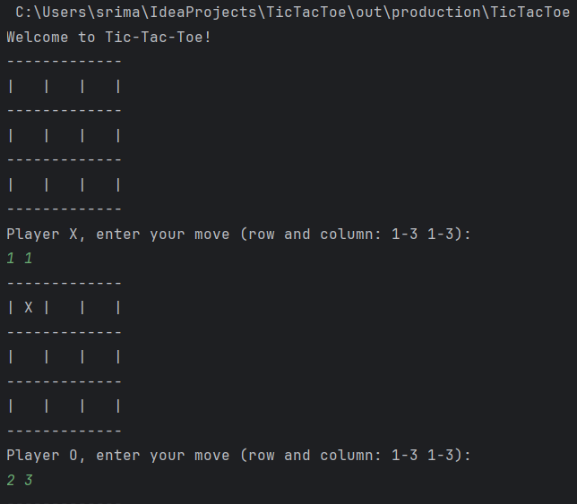
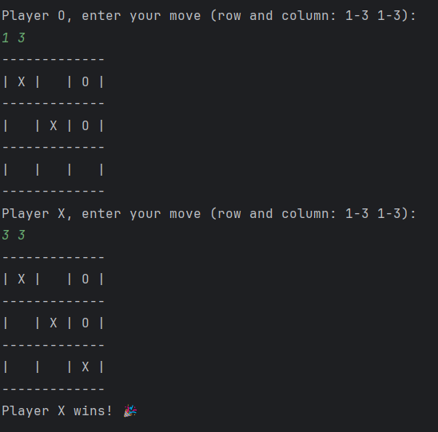

# Tic-Tac-Toe Game 🎮

A simple **Tic-Tac-Toe** game implemented in **Java**. The game allows two players to play against each other in a terminal-based interface.

## 🖥️ Screenshots

### Game Start


### Game Over


## 🚀 Features
- Two-player mode
- Simple command-line interface
- Real-time game status updates
- Detects win, draw, and invalid moves

## 📜 Rules
```txt
1. The game is played on a 3x3 grid.
2. Players take turns placing their marks (X or O) on an empty cell.
3. The first player to get three marks in a row, column, or diagonal wins.
4. If all cells are filled and no player has won, the game ends in a draw.
5. A move is considered invalid if the chosen cell is already occupied or out of range.
6. The game continues until a player wins or there is a draw.
